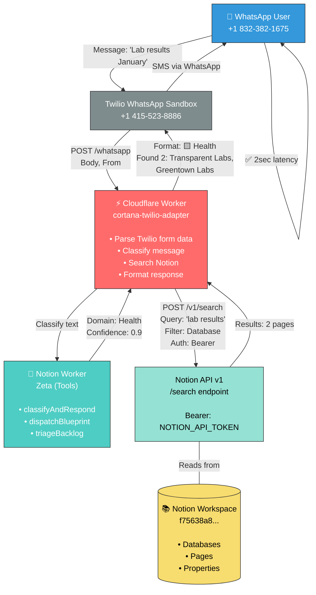

# Architecture Diagram



## Data Flow

```
1. User sends WhatsApp message
   └─→ Twilio receives & forwards to webhook

2. Cloudflare Worker processes
   ├─→ Extracts message content & phone number
   ├─→ Classifies across 6 Blueprint domains
   ├─→ Searches Notion workspace
   └─→ Formats response

3. Notion API search
   └─→ Queries workspace databases
       └─→ Returns matching pages + metadata

4. Twilio sends reply
   └─→ User receives in WhatsApp (2 sec round-trip)
```

## Blueprint Domains

| Domain | Emoji | Keywords | Example Match |
|--------|-------|----------|----------------|
| Personal | 🟥 | friends, weekend, family | "meeting my friends" |
| Health | 🟨 | lab, doctor, fitness, wellness | "lab results" |
| Projects | 🟪 | build, launch, shipped | "project shipped" |
| Work | 🟦 | r-cubed, client, proposal | "R-Cubed meeting" |
| Growth | ⬛ | learn, course, skill | "learning Python" |
| Data | 🗄️ | metrics, analytics, kpi | "revenue dashboard" |

## Tech Stack

```
Frontend
├─ Twilio WhatsApp SDK
├─ Notion Workspace

Workers (Compute)
├─ Cloudflare Workers (TypeScript)
│  └─ wrangler CLI (deployment)
│
└─ Notion Workers Alpha (TypeScript)
   └─ ntn CLI (deployment)

APIs
├─ Notion API v1 (/search)
├─ Twilio SMS API (/Messages.json)

Storage
└─ Notion (Databases)

Auth
├─ NOTION_API_TOKEN (Bearer)
├─ TWILIO_ACCOUNT_SID (Basic)
└─ TWILIO_AUTH_TOKEN (Basic)
```

## Deployment URLs

- **Cloudflare:** https://cortana-twilio-adapter.cortana-khanstruct.workers.dev/whatsapp
- **GitHub:** https://github.com/zainkhan1994/cortana-notion-mcp
- **MLH Challenge:** https://www.notionmcpchallenge.com

---

*Generated March 28, 2026 - Notion Workers MVP*
